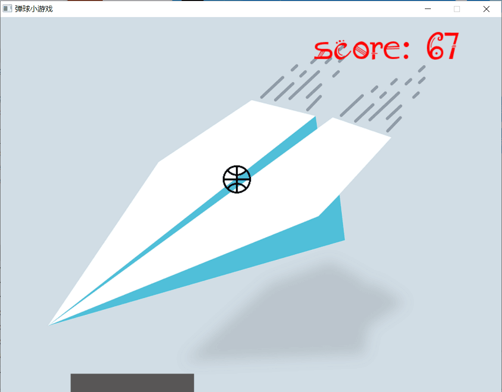

# 弹球小游戏

## demo

## 从零开始开发过程思路:
- [x] 创建一个游戏窗口, 设置循环和退出方式
- [x] 找素材: 背景图, 小球图, 横杠图
- [x] 载入各种图形, 形成普通的静态游戏界面
- [x] 设置小球的移动, 触到边沿(除bottom)反弹
- [x] 设置底线, 小球在bottom触碰line反弹, 否则game over
- [x] 设置游戏声音, 包括start, knock, game over声音.
- [x] 设置进入游戏选项画面
- [x] 设置game over画面
- [x] 设置游戏难度递增, 速度
- [ ] 设置多人, 多球模式(用class好做些)
- [x] 设置游戏分数显示及存档